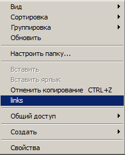
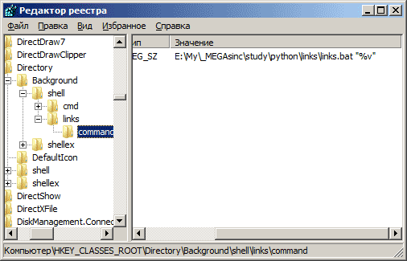
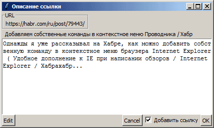
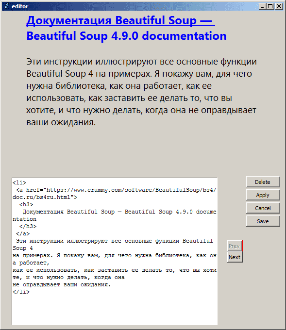

#Links

Создание HTML страницы со списком ссылок [links.html](links.html). Ссылка берётся из буфера обмена. Скрипт вызывается из контекстного меню проводника в папке, где нужно создать файл ссылок.

В разделе реестра **HKEY_CLASSES_ROOT\Directory\Background\Shell** добавляется подраздел, с командой, запускающей файл links.bat, который запускает скрипт.

###Окно добавления ссылки

###Окно редактирования файла links.html

